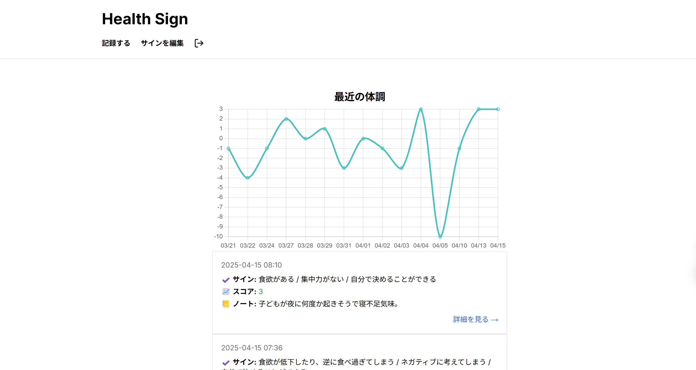

# 🚩 アプリ概要

## アプリ名：Health Sign

## デモ

- URL
- ユーザー名
- パスワード

## 概要

このアプリはユーザーが自身の体調のサインを記録、可視化し自身のストレスや疲労等の状態に早く気づくことで、対処につなげるためのアプリです。また、あとから記録を振り返ることでストレス要因の分析やストレス対処を考えるきっかけにできるアプリです。

## 背景

障害福祉の仕事に従事していますが、自身の状態に気づけず体調を崩してしまう利用者の方が多くいらっしゃいました。そのため思い出したときに気軽に記録できるツールが欲しいと感じておりました。
また、障害の有無関係なく日々の些細な体調の変化や予兆に気づくことの難しさは私自身も感じておりました。
以上の理由から手軽にいつでも体調記録のできる、誰しも使えるようなアプリの開発に至りました。

## 主な機能

✅ 新規登録、ログイン
✅ 日々の体調を記録  
✅ 日々の体調サインの記録をスコア化しグラフとして可視化  

## 今後の実装予定機能

- 自身の体調サイン登録機能
- 日記登録機能

## 使い方

## 🛠 使用技術

### フロントエンド

- 
- 
- 
- 
- 

### バックエンド

- 

### 認証

- 

### ツール

- 
- 

##アプリ表示側イメージ

##デモ　リンク
